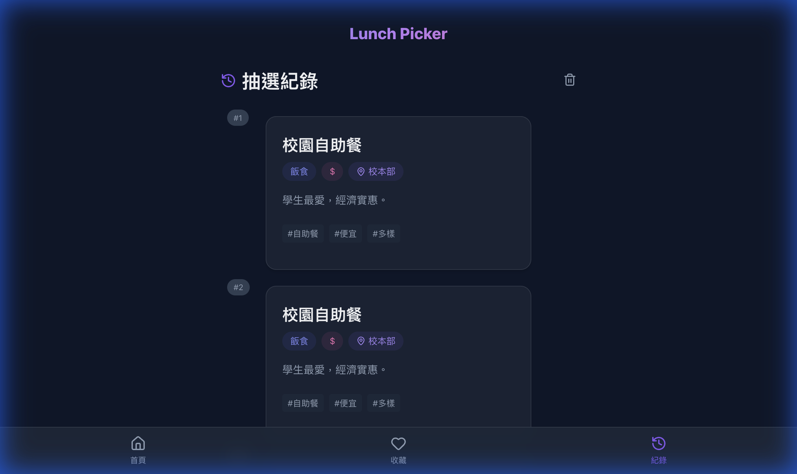

# 🍱 Lunch Picker — 今天吃什麼？

> 一個幫助你快速決定午餐的網頁應用程式，不再為選擇困難症煩惱！

## 📱 專案展示

### 完整操作流程


### 介面截圖


<!-- slide -->

<!-- slide -->

<!-- slide -->



---

## ✨ 功能特色

### 🎯 核心功能

#### 1. 智慧推薦系統
- **多條件篩選**：根據食物類型、價位、地點進行精準推薦
- **避雷機制**：不喜歡的店家可以加入黑名單，下次不再推薦
- **隨機抽選**：符合條件的餐廳隨機推薦，增加驚喜感

#### 2. 偏好設定
- **飲食類型**（多選）：飯食、麵食、湯品、小吃炸物、西式、異國料理
- **價位範圍**（單選）：$ (80-120元)、$$ (120-160元)、$$$ (160-200元)
- **用餐地點**（單選）：校本部、公館、師大夜市

#### 3. 個人化管理
- ❤️ **收藏清單**：儲存你喜歡的餐廳，隨時查看
- 📜 **歷史紀錄**：記錄最近 10 筆推薦，方便回顧
- 🚫 **避雷清單**：封鎖不想再看到的餐廳
- 💾 **偏好記憶**：自動記住上次的設定，下次開啟直接使用

### 🎨 設計亮點

- **深色模式**：舒適的深色主題，減少眼睛疲勞
- **玻璃擬態**：現代化的毛玻璃效果，提升視覺質感
- **流動漸層**：靛藍、紫羅蘭、粉紅的漸層配色
- **微動畫**：流暢的過場動畫與懸停效果
- **響應式設計**：完美支援手機與桌面裝置
- **底部導航**：類似原生 App 的操作體驗

---

## 🚀 快速開始

### 安裝與運行

```bash
# 1. 克隆專案（或下載並解壓）
git clone <repository-url>
cd food_recommend_web

# 2. 安裝依賴套件
npm install

# 3. 啟動開發伺服器
npm run dev

# 4. 開啟瀏覽器訪問
# 開啟 http://localhost:5173
```

### 生產環境構建

```bash
# 建立生產版本
npm run build

# 預覽生產版本
npm run preview
```

---

## 🏗️ 專案架構說明

### 技術棧

| 技術 | 說明 |
|------|------|
| **React 18** | 前端框架 |
| **Vite** | 快速的建構工具與開發伺服器 |
| **React Router DOM** | 單頁應用程式路由管理 |
| **Lucide React** | 現代化的圖示庫 |
| **Vanilla CSS** | 原生 CSS，使用 CSS 變數與現代特性 |
| **LocalStorage API** | 瀏覽器本地儲存 |

### 專案目錄結構

```
food_recommend_web/
├── public/              # 靜態資源
├── src/
│   ├── components/      # React 元件
│   │   ├── Layout.jsx         # 主要佈局（包含導航列）
│   │   └── RestaurantCard.jsx # 餐廳卡片元件
│   ├── pages/           # 頁面元件
│   │   ├── Home.jsx           # 首頁
│   │   ├── Preferences.jsx    # 偏好設定頁
│   │   ├── Result.jsx         # 推薦結果頁
│   │   ├── Favorites.jsx      # 收藏清單頁
│   │   └── History.jsx        # 歷史紀錄頁
│   ├── utils/           # 工具函式
│   │   ├── mockData.js        # 模擬餐廳資料
│   │   ├── storage.js         # LocalStorage 操作封裝
│   │   └── recommendationEngine.js # 推薦演算法
│   ├── App.jsx          # 主要應用元件（路由配置）
│   ├── main.jsx         # 應用程式入口
│   └── index.css        # 全域樣式與設計系統
├── index.html           # HTML 模板
├── package.json         # 專案配置與依賴
└── vite.config.js       # Vite 配置
```

### 核心檔案說明

#### 📄 `src/App.jsx`
應用程式的主要元件，配置了所有路由：
- `/` - 首頁
- `/preferences` - 偏好設定
- `/result` - 推薦結果
- `/favorites` - 收藏清單
- `/history` - 歷史紀錄

#### 📄 `src/components/Layout.jsx`
整個應用的佈局框架，包含：
- 頂部標題
- 主要內容區域（透過 `<Outlet />` 渲染子路由）
- 底部導航列（首頁、收藏、紀錄）

#### 📄 `src/components/RestaurantCard.jsx`
可重用的餐廳卡片元件，顯示：
- 餐廳名稱與描述
- 類型、價位、地點標籤
- 關鍵字標籤
- 收藏按鈕（愛心圖示）
- 避雷按鈕（僅在推薦結果頁顯示）

#### 📄 `src/utils/mockData.js`
包含所有模擬資料：
- `restaurants` - 12 間餐廳資料陣列
- `locations` - 地點選項（校本部、公館、師大夜市）
- `prices` - 價位選項（$、$$、$$$）
- `types` - 食物類型（飯食、麵食、湯品等）

**餐廳資料結構範例：**
```javascript
{
  id: 1,
  name: "阿英滷肉飯",
  type: "rice",           // 對應 types 的 id
  price: "$",             // 對應 prices 的 id
  location: "gongguan",   // 對應 locations 的 id
  tags: ["滷肉飯", "台式", "排隊名店"],
  description: "傳說中的神級滷肉飯，肥而不膩。"
}
```

#### 📄 `src/utils/storage.js`
封裝 `localStorage` 操作，提供簡潔的 API：
- `getFavorites()` / `setFavorites(data)` - 管理收藏
- `getBlocklist()` / `setBlocklist(data)` - 管理避雷清單
- `getHistory()` / `setHistory(data)` - 管理歷史紀錄
- `getPreferences()` / `setPreferences(data)` - 管理偏好設定

**儲存鍵值：**
- `lunch_picker_favorites` - 收藏的餐廳陣列
- `lunch_picker_blocklist` - 避雷的餐廳 ID 陣列
- `lunch_picker_history` - 歷史推薦陣列（最多 10 筆）
- `lunch_picker_preferences` - 上次選擇的偏好設定物件

#### 📄 `src/utils/recommendationEngine.js`
推薦演算法的核心邏輯：

```javascript
getRecommendation(criteria)
```

**篩選流程：**
1. 檢查餐廳是否在避雷清單中 → 排除
2. 檢查地點是否符合 → 保留符合的
3. 檢查價位是否符合 → 保留符合的
4. 檢查類型是否符合（至少符合一個選中的類型）→ 保留符合的
5. 從符合條件的餐廳中隨機選擇一間
6. 若無符合條件的餐廳，回傳 `null`

#### 📄 `src/index.css`
全域樣式與設計系統，定義了：

**CSS 變數（設計 Token）：**
```css
--color-primary: #6366f1      /* 主色調（靛藍） */
--color-secondary: #ec4899    /* 次要色（粉紅） */
--color-accent: #8b5cf6       /* 強調色（紫羅蘭） */
--color-background: #0f172a   /* 背景色（深板岩） */
--color-surface: #1e293b      /* 表面色（中板岩） */
```

**通用元件類別：**
- `.btn` - 按鈕基礎樣式
- `.btn-primary` - 主要按鈕（漸層背景）
- `.btn-secondary` - 次要按鈕
- `.btn-outline` - 外框按鈕
- `.card` - 卡片容器（玻璃擬態效果）
- `.text-gradient` - 漸層文字
- `.fade-in` - 淡入動畫

### 資料流程圖

```
使用者選擇偏好
    ↓
儲存到 localStorage (preferences)
    ↓
傳遞至推薦引擎 (recommendationEngine.js)
    ↓
篩選餐廳 (排除 blocklist、符合條件)
    ↓
隨機選擇一間
    ↓
顯示結果 + 儲存至 history
    ↓
使用者可進行操作：
    - 收藏 → 加入 favorites
    - 避雷 → 加入 blocklist + 重新推薦
    - 再換一間 → 重新推薦
```

---

## 🎓 給新手開發者的說明

### React 基礎概念

#### 1. 元件（Components）
本專案使用 **函式元件** 與 **Hooks**：
- `useState` - 管理元件內部狀態
- `useEffect` - 處理副作用（如讀取 localStorage）
- `useNavigate` - 程式化導航
- `useLocation` - 取得當前路由資訊

**範例：**
```javascript
const [favorites, setFavorites] = useState([]); // 宣告狀態

useEffect(() => {
  setFavorites(storage.getFavorites()); // 元件載入時讀取資料
}, []);
```

#### 2. Props（屬性傳遞）
父元件傳遞資料給子元件：

```javascript
<RestaurantCard 
  restaurant={data}           // 傳遞餐廳物件
  isFavorite={true}           // 傳遞布林值
  onToggleFavorite={handler}  // 傳遞函式
/>
```

#### 3. 路由（React Router）
使用 `BrowserRouter` 實現單頁應用：
- `<Route>` - 定義路由規則
- `<Link>` - 導航連結（不會重新載入頁面）
- `useNavigate()` - 程式化跳轉
- `location.state` - 在路由間傳遞資料

### 如何擴充功能

#### 新增餐廳
編輯 `src/utils/mockData.js`，在 `restaurants` 陣列中新增物件：

```javascript
{
  id: 13,  // 記得 ID 不要重複
  name: "新餐廳名稱",
  type: "noodle",  // 必須是 types 中定義的 id
  price: "$$",
  location: "gongguan",
  tags: ["標籤1", "標籤2"],
  description: "餐廳介紹"
}
```

#### 新增食物類型
1. 在 `mockData.js` 的 `types` 陣列中新增
2. 確保有餐廳使用這個類型

#### 修改顏色主題
編輯 `src/index.css` 的 CSS 變數：

```css
:root {
  --color-primary: #your-color;  /* 改成你喜歡的顏色 */
}
```

---

## 📝 授權

本專案為教學與展示用途，歡迎自由使用與修改。

---

## 🤝 貢獻

歡迎提出問題、建議或改進！

---

**製作日期：** 2025-11-21  
**框架版本：** React 18 + Vite 7
